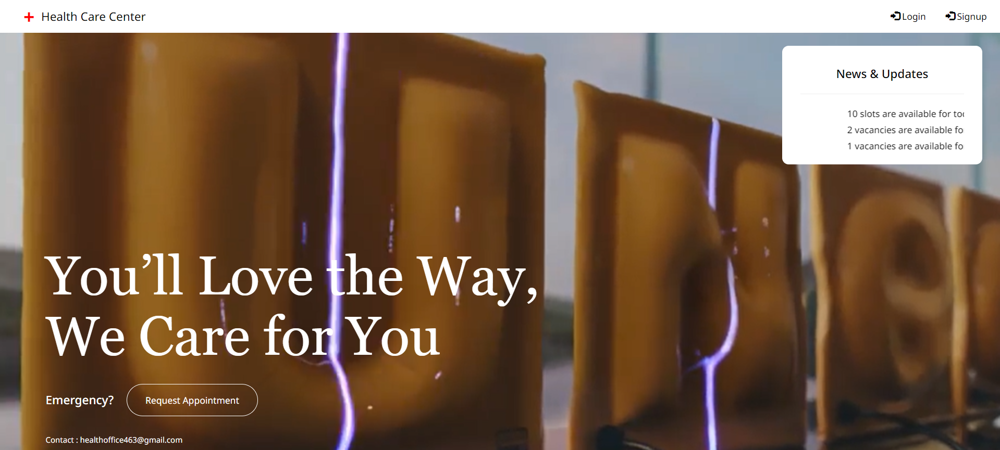
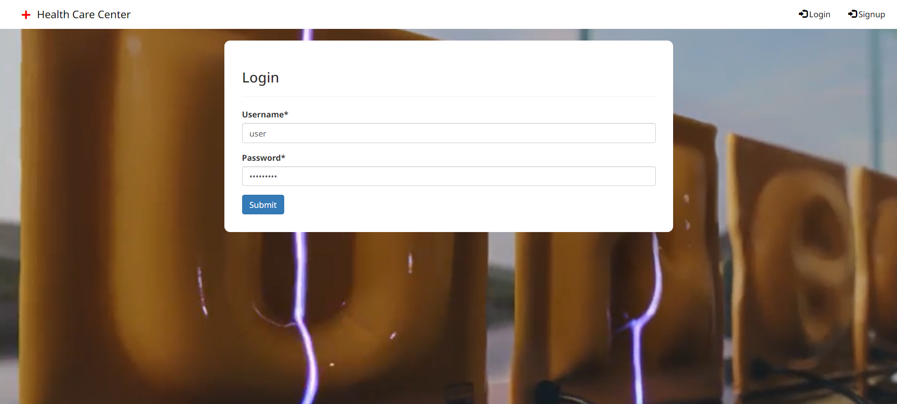
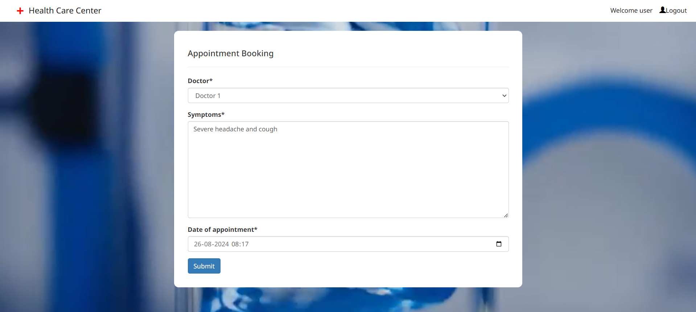
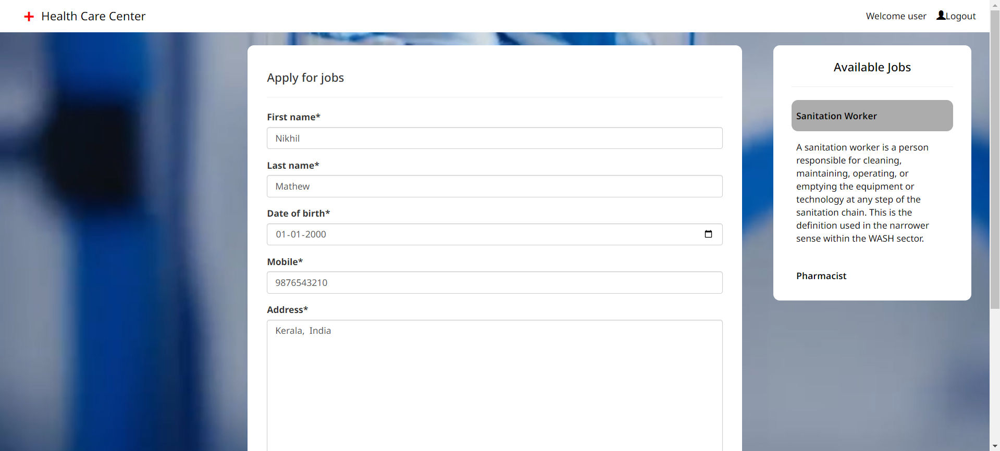
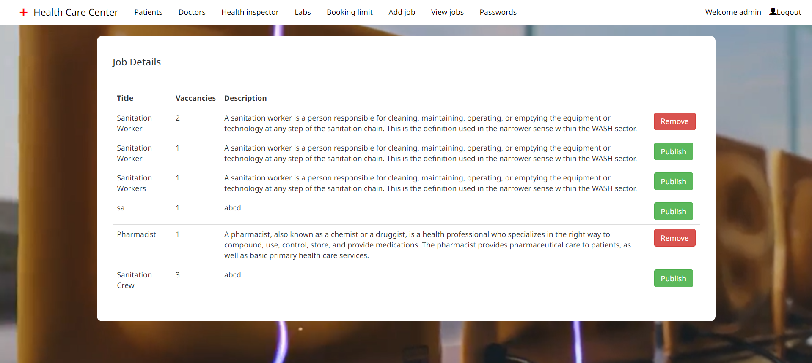

# Health Office Management System

Health Office Management System is designed to replace the pen and paper approach. This 
software is easy to use as well as user-friendly. The main function of the system is to register 
and store patient details and doctor details and retrieve these details as and when required, and 
also to manipulate these details meaningfully. System also arranges facilities like OP booking, 
lab booking and recruiting citizens for daily wages jobs. System input contains patient details, 
diagnosis details, while system output is to get these details on to the screen. The Health Office 
Management System can be entered using a username and password. It is accessible by an 
Admin, Doctor, User, Health inspector. Only they can add data into the database. The data can 
be retrieved easily and end to end encrypted and processing is fast. The admin has the facility 
to set the vaccination date and to limit job vacancy. There is also lab facility which the user 
can make use. The lab will send the lab reports to the user and doctor. The doctor sends the 
prescription to lab for lab test. Our entire project aims to make the Health Office automated so 
that the citizens find it easier, safe and less time consuming.

# PROPOSED SYSTEM 
The Health Office Management System is designed for any Health Office to replace their 
existing manual paper based system. In this system a patient can have his/her profile created 
and check whether a doctor is available and he or she can perform an online op booking, get 
notified on vaccine dates. People can also apply for daily wages jobs by registering online, this
automation makes the recruitment process more simple and fast, less paper work and provides 
confidentiality of personal data. The new system is to control the information of patients and 
other personal data of the people. These services are to be provided in an efficient, cost effective 
manner, with the goal of reducing the time and resources currently required for such tasks.

# Features of Proposed System 
1. It deals with monitoring the information of users and doctors.
2. Provided facilities for op booking and lab booking.
3. Provides facilities for applying for daily wages job.
4. Editing, adding and updating of record is improved which result in proper resource management.
5. Users can directly give feedbacks and reviews.
6. Provides information about vaccine dates

# Tools used 🛠️
1. Language : Python
2. Framewwork : Django
3. IDE : PyCharm
4. Frontend : HTML, CSS, Bootstrap, JavaScript
5. Backend : SQLite
6. Web Server : Apache

## Login page

## User bookings

## User apply jons

## Admin manage jobs

